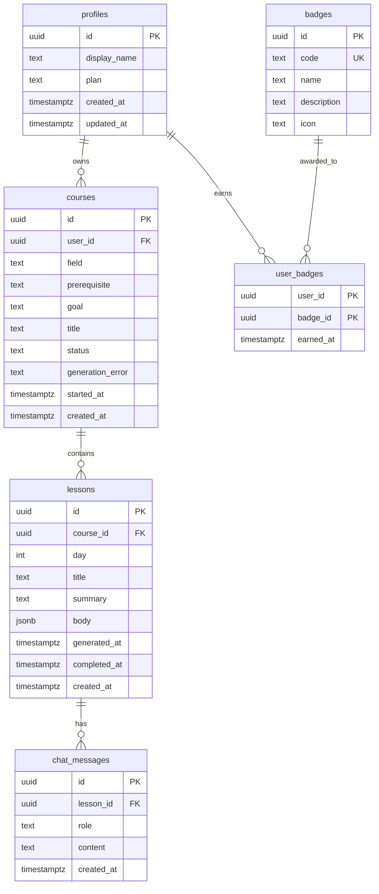

# DailyLearn DB スキーマ

これから実装する Supabase Postgres のテーブル設計。`direction.md` の Phase 2〜6 で順次マイグレーションに落とす。

## 設計の前提

- 認証は **Supabase Auth (`auth.users`)** を使い、アプリ固有のユーザー情報は `public.profiles` に持つ(1:1)
- 全テーブルは作成と同時に **RLS ON**。「他人の行を絶対に読み書きさせない」を全テーブルで担保
- 主キーは原則 `uuid`(`gen_random_uuid()`)
- 時刻はすべて `timestamptz`(`timestamp` は使わない)
- ステータス系は `text + CHECK 制約` で表現(enum 型より migration が楽)
- 外部キーカラムには明示的に index を貼る(Postgres は FK だけでは index 自動生成しない)
- **「レッスンは個人専用 AI 生成コンテンツ」前提で、ユーザー紐付けは原則 `course → user` 経由で辿る**(中間テーブルや `user_id` 重複保持はしない)
- ストリークなどの派生情報は列で持たず **SQL 関数で都度算出**(同期バグを原理的に発生させない)
- レッスン本文は自由 Markdown ではなく **構造化 JSON (`LessonBody`)** で保存。モックの専用ブロック(ポイント/ヒント/アクション)を確実に描画でき、Renderer 側に表示順や装飾の **推測** を持ち込まない

## ER 図

> `profiles` は `auth.users` と 1:1(`profiles.id` = `auth.users.id`)。`auth.users` は Supabase 管理スキーマのため図からは省略。



## テーブル定義

### `profiles` — アプリ固有のユーザー情報

| カラム | 型 | 制約 | メモ |
|---|---|---|---|
| `id` | `uuid` | PK, FK → `auth.users(id)` ON DELETE CASCADE | `auth.users.id` と同値 |
| `display_name` | `text` | NOT NULL | 表示名 |
| `plan` | `text` | NOT NULL DEFAULT `'free'`, CHECK in (`'free'`,`'paid'`) | 課金プラン |
| `created_at` | `timestamptz` | NOT NULL DEFAULT `now()` | |
| `updated_at` | `timestamptz` | NOT NULL DEFAULT `now()` | トリガで更新 |

**自動作成**: `auth.users` への INSERT を AFTER トリガで拾い、`handle_new_user()` で対応する `profiles` 行を作る。

**ストリーク等の派生値はここに持たない** — SQL 関数 `get_streak(uuid)` で `lessons.completed_at` から都度算出。

### `courses` — 30日コース

| カラム | 型 | 制約 | メモ |
|---|---|---|---|
| `id` | `uuid` | PK DEFAULT `gen_random_uuid()` | |
| `user_id` | `uuid` | NOT NULL, FK → `auth.users(id)` ON DELETE CASCADE | |
| `field` | `text` | NOT NULL | 例: "投資", "起業" |
| `prerequisite` | `text` | NULL | ユーザーが申告した前提知識の自由記述。未入力 = 基礎から組み立てる |
| `goal` | `text` | NOT NULL | ユーザー入力の目標 |
| `title` | `text` | NOT NULL | AI 生成のコース名。`status='generating'` 中は `field` を流用した仮値が入り、骨格生成完了時に確定値へ UPDATE される |
| `status` | `text` | NOT NULL DEFAULT `'generating'`, CHECK in (`'generating'`,`'active'`,`'completed'`,`'failed'`,`'archived'`) | ライフサイクル: `generating`(Edge Function が背景生成中)→ `active`(骨格生成成功・通常表示)→ `completed`(全30日完了、将来機能)。失敗パスは `generating → failed`。ユーザーが消したら `archived` |
| `generation_error` | `text` | NULL | `status='failed'` のときに UI で出すエラー要約。Phase 4 で追加 |
| `started_at` | `timestamptz` | NULL | 初回レッスン完了時にセット(コース INSERT 時点では NULL) |
| `created_at` | `timestamptz` | NOT NULL DEFAULT `now()` | |

**index**: `(user_id, status)` — ユーザー画面の「アクティブなコース一覧」用。

**Realtime**: `courses` を `supabase_realtime` publication に追加する(Phase 4)。Edge Function の背景タスクが `status` を `'generating' → 'active' / 'failed'` に更新した瞬間にホーム画面のカードが切り替わるよう、フロントは `postgres_changes` で購読する。

### `lessons` — 1日分の学習コンテンツ(個人専用)

| カラム | 型 | 制約 | メモ |
|---|---|---|---|
| `id` | `uuid` | PK DEFAULT `gen_random_uuid()` | |
| `course_id` | `uuid` | NOT NULL, FK → `courses(id)` ON DELETE CASCADE | |
| `day` | `int` | NOT NULL, CHECK between 1 and 30 | |
| `title` | `text` | NOT NULL | コース生成時に確定 |
| `summary` | `text` | NOT NULL | コース生成時に確定 |
| `body` | `jsonb` | NULL | 本文の構造化データ。スキーマは下記 `LessonBody` を参照。On-demand 生成までは NULL(=未生成と等価、別途 status 列は持たない) |
| `generated_at` | `timestamptz` | NULL | 本文生成時にセット。「いつ生成したか」は `body` の NULL 判定から導出できないため独立カラムで保持 |
| `completed_at` | `timestamptz` | NULL | NULL = 未完了。値あり = 完了日時 |
| `prefetch_batch_id` | `text` | NULL | Anthropic Batch API 投入中の batch ID。未投入 / 結果取り込み済み = NULL(Phase 5 で追加) |
| `prefetch_submitted_at` | `timestamptz` | NULL | Batch 投入時刻。24h 超過時は諦めて NULL に戻す(Phase 5 で追加) |
| `created_at` | `timestamptz` | NOT NULL DEFAULT `now()` | |

**制約**: `UNIQUE (course_id, day)`

**完了処理**: `UPDATE lessons SET completed_at = now() WHERE id = $1 AND completed_at IS NULL`(RLS が「自コースのレッスンか」をチェック)。再完了は不可。

#### 本文 JSON スキーマ (`LessonBody`)

`body` カラムには以下の構造の JSON を入れる。型と Zod スキーマは `src/lib/lessonBody.ts`(Phase 5 で作成)に単一ソースで定義し、AI Function 側でも同じものを使って tool_use の input_schema を導出する(`zod-to-json-schema`)。

```ts
type LessonBody = {
  v: 1
  hero: {
    theme: string                                    // 例: 'FRAMEWORK · 3C'
    visual: 'bubbles' | 'chart' | 'icon' | 'none'    // ヒーロー視覚パターン
  }
  points: [string, string, string]                   // 必ず3個
  blocks: Array<
    | { type: 'paragraph'; markdown: string }        // 中身は自由 Markdown(==hl==, **bold** OK)
    | { type: 'tip'; text: string }                  // 💡 ヒント
    | { type: 'action'; text: string }               // ✅ 今日のアクション
  >                                                  // 3〜8個。action は必ず1個。tip は最大2個
}
```

**ブロック順 = 表示順**。`blocks` 配列の順番がそのまま画面の上から下に描画される(Renderer 側で並べ替えしない)。

具体例:

```json
{
  "v": 1,
  "hero": { "theme": "FRAMEWORK · 3C", "visual": "bubbles" },
  "points": [
    "Customer(顧客)から始める",
    "自社と競合は「比較」する",
    "スキマを探す視点を持つ"
  ],
  "blocks": [
    { "type": "paragraph", "markdown": "副業を始めるとき、最初にぶつかる壁は「==誰に何を売るか==」です。**3C** はこの問いに答える最も基本的な道具です。" },
    { "type": "tip", "text": "順番が大事。Customer → Competitor → Company の順で考えること。" },
    { "type": "paragraph", "markdown": "顧客のニーズを把握せずに競合を見ても意味がありません。まず「**困っている人**」を3人具体的に思い浮かべるところから始めます。" },
    { "type": "paragraph", "markdown": "次に競合を見ます。**同じ顧客**を取り合っているのは誰か。直接競合だけでなく、代替手段(YouTube・本など)も含めて広く見ます。" },
    { "type": "action", "text": "自分が始めたい副業の「想定顧客」を3人、紙に書き出してみる。" }
  ]
}
```

#### 本文生成フロー

呼び出し経路は 2 つ。プロンプト・retry 仕様は両方で同一(実装も同一の生成関数を共有):

- **Realtime 生成**: Edge Function `lessons-generate` が呼ばれた時に Opus を 1 回呼んで生成
  - 新規コース作成直後の Day 1 生成(`courses-generate` の background task 内で共有モジュールとして呼ばれる)
  - Batch 失敗 / 深夜完了 → 翌朝 6 時前にオープンしたケース
  - その他、`body IS NULL` のレッスンを開いた時の汎用フォールバック
- **Batch 投入**: Edge Function `lessons-prefetch-next` がレッスン完了時に Anthropic Batch API へ投入
  - 投入のみで結果取り込みはしない。結果は下記の Supabase pg_cron(毎朝 6 時)が一括 pull

**Claude Opus 4.7 を 1 回呼ぶだけで完結する単段構成**(`save_lesson` Tool Use で `LessonBody` JSON を直接得る)。

当初は Opus でドラフト → Sonnet で整形 という 2 段階構成を検討したが、第三者レビューで以下が指摘されたため棄却:

- 「構造化を課すと文章品質が落ちる」は Claude 3 世代の経験則で、4.x の Tool Use は schema 追従精度が高く実務上の劣化はほぼ無視できる
- 整形ステップが「`==highlight==` の喪失 / `tip` と `paragraph` の誤分類 / カウント制約違反のごまかし」という別の品質劣化を生む(本末転倒)
- 2 段階分離は API コール数 / Batch 待機 / 障害系統 / 運用監視対象を全て倍にする(Batch API は最悪 24h × 2 = 48h 待ちになる)
- 単段で実装して 50 件単位で品質を実測し、本当に劣化が出たら 2 段階に戻すのが正しい順序

1. **生成**: Claude Opus 4.7 + extended thinking + `save_lesson` Tool Use(input_schema は Zod から自動生成、`tool_choice` で強制)で `LessonBody` JSON を直接出力。プロンプトには以下を必ず同梱:
   - 当該コースの `(field, goal, prerequisite)` … トーン・深さの校正
   - コース全30件の `(day, title, summary)` … 学習アーク全体を見せる(Day 間の重複・矛盾防止)
   - 当該レッスン自身の `(day, title, summary)` を「これから書く対象」として強調
   - **few-shot 例 2〜3 件**(良質な `LessonBody` JSON)… `==highlight==` 記法の維持・block 構成・トーン統一に最も効く
2. **Zod 検証**: NG なら **具体的なエラー内容**(例: `points must have exactly 3 items, got 4` / `blocks: action must appear exactly once`)を文字列化してフィードバックし、Claude に 1 回だけ再生成させる。汎用メッセージだと retry 成功率が大きく落ちるため、Zod の `error.issues` を必ずそのまま渡す
3. **保存**: 検証通過したら `lessons.body` に JSON を入れ、`generated_at = now()`(`body IS NOT NULL` で「生成済み」を判定)。`UPDATE` は **`WHERE body IS NULL`** で守る(Batch 経路と Realtime 経路のレース対策)

**Prompt caching**: システムプロンプト + `LessonBody` スキーマ説明 + few-shot 例 + コース全30件リストは全レッスンで再利用されるので `cache_control` を付ける。retry / 連続生成でキャッシュヒットすれば input コストが約 1/10。

**過去 body は渡さない**: コストが約 10 倍になり、title + summary だけで十分なアーク把握が見込めるため。アーク逸脱が問題化したら再検討。

#### 翌日レッスンの事前生成(Batch API)

毎レッスン完了時に翌日レッスンの本文生成を Anthropic Batch API へ投入し、ユーザーが翌日開いた瞬間にローディングなしで読める状態を作る。Batch API は通常価格の **50%** のため、ユーザーが継続するほど Phase 5 全体の生成コストが下がる。

**発火**(クライアントが `markLessonComplete` 成功後に `supabase.functions.invoke('lessons-prefetch-next', { body: { lesson_id } })` を叩く):

- 完了したレッスンの `day` が、そのコース内の **完了済みレッスンの最大 `day`** と一致(=「最新を進めた完了」のときだけ発火。過去日を埋めた完了では何もしない)
- `day + 1 ≤ 30`(コース未完)
- 翌日レッスンの `body IS NULL` かつ `prefetch_batch_id IS NULL`(二重投入防止)

条件成立時、Batch に 1 件投入し `prefetch_batch_id` / `prefetch_submitted_at` をセット。プロンプト(コースメタ + 全30件 title/summary)は通常生成と同一。

**結果取り込み**(Supabase pg_cron が毎朝 06:00 JST = `0 21 * * *` UTC に Edge Function `prefetch-pull` を起動して一括処理):

`lessons WHERE prefetch_batch_id IS NOT NULL AND body IS NULL` を全件取り出し、Anthropic Batch API で各 `prefetch_batch_id` の状態を確認:

- 完了済み + Zod 検証通過 → `body` を保存(`WHERE body IS NULL`)、`generated_at = now()`、`prefetch_batch_id = NULL`
- 未完了 / 失敗 / Zod NG → `prefetch_batch_id = NULL` に戻して諦める(以降の開封で Realtime が走る)

**開封時の動作**: Edge Function `lessons-generate` は `body IS NULL` なら Realtime のみ。Batch のことは知らない(分岐は pg_cron に集約)。深夜完了 → 翌朝 6 時時点で Batch 未完了の場合は Realtime にフォールバックし、その日のバッチは破棄される(取りこぼしを許容するシンプル運用)。

**Race protection**: `body` の UPDATE は常に **`WHERE body IS NULL`**。これにより「6 時 cron が body 保存 → 直後にユーザーが開いて Realtime」がぶつかっても二重生成にならない。

#### Renderer

`<LessonRenderer body={...} />` が以下を担当:
- `hero.visual` で分岐してヒーロー描画
- `points` を「📌 今日の3つのポイント」枠に展開
- `blocks` を `.map` で順番通りに `<Paragraph>` / `<TipBox>` / `<ActionBox>` に振り分け
- `paragraph.markdown` 内の `==xxx==`(ハイライト)と `**xxx**`(太字)はミニ MD パーサで `<strong>` に置換

### `chat_messages` — AIコーチの発言ログ

レッスンごとに1本のチャットしか持たないため、**スレッドテーブルは設けず `lesson_id` で直接ぶら下げる**。

| カラム | 型 | 制約 | メモ |
|---|---|---|---|
| `id` | `uuid` | PK DEFAULT `gen_random_uuid()` | |
| `lesson_id` | `uuid` | NOT NULL, FK → `lessons(id)` ON DELETE CASCADE | 所属レッスン |
| `role` | `text` | NOT NULL, CHECK in (`'user'`,`'assistant'`) | Anthropic API の role 仕様に合わせる(変換不要)。UI 表示時のみ `'assistant'` を「コーチ」とラベル化 |
| `content` | `text` | NOT NULL | |
| `created_at` | `timestamptz` | NOT NULL DEFAULT `now()` | |

**index**: `(lesson_id, created_at)` — チャットを時系列で取り出す用。

**所有権**: `lesson → course → user_id` で辿る。

**API**: Edge Function `chat-send`(入力 `{ lesson_id, content }`、`thread_id` ベースではなく `lesson_id` ベース)。

### `badges` — バッジマスタ(管理者のみ INSERT)

| カラム | 型 | 制約 | メモ |
|---|---|---|---|
| `id` | `uuid` | PK DEFAULT `gen_random_uuid()` | |
| `code` | `text` | UNIQUE NOT NULL | 例: `'first_lesson'`, `'streak_7'` |
| `name` | `text` | NOT NULL | 表示名 |
| `description` | `text` | NOT NULL | |
| `icon` | `text` | NOT NULL | 絵文字 or アイコン名 |

### `user_badges` — 獲得バッジ

| カラム | 型 | 制約 | メモ |
|---|---|---|---|
| `user_id` | `uuid` | PK, FK → `auth.users(id)` ON DELETE CASCADE | |
| `badge_id` | `uuid` | PK, FK → `badges(id)` ON DELETE CASCADE | |
| `earned_at` | `timestamptz` | NOT NULL DEFAULT `now()` | |

`badges` はユーザー横断のマスタなので、`user_badges` は中間テーブルとして必要。

## RLS 方針

全テーブル `ALTER TABLE ... ENABLE ROW LEVEL SECURITY;`。

| テーブル | SELECT | INSERT | UPDATE | DELETE |
|---|---|---|---|---|
| `profiles` | `id = auth.uid()` | (トリガ経由のみ) | `id = auth.uid()` | × |
| `courses` | `user_id = auth.uid()` | `user_id = auth.uid()` | `user_id = auth.uid()` | `user_id = auth.uid()` |
| `lessons` | `course_id` の所有者が `auth.uid()` | service_role のみ | 同左(本文生成は service_role / `completed_at` の更新のみフロントから可) | コース所有者と一致 |
| `chat_messages` | `lesson_id`(コース)の所有者が `auth.uid()` | `role = 'user'` かつ所有者一致 / `assistant` は service_role | × | × |
| `badges` | 全員 SELECT 可 | service_role のみ | service_role のみ | service_role のみ |
| `user_badges` | `user_id = auth.uid()` | service_role のみ | × | × |

**ポイント**:
- **`lessons` の INSERT は AI 生成 Function だけが行う** → `service_role` キー経由(フロントには露出しない)
- **`completed_at` のセットだけは UPDATE ポリシーでフロントから許可**(`completed_at IS NULL` のときのみに WITH CHECK で制限)
- **チャット**: ユーザー発言はフロントから INSERT、AI 応答は service_role からのみ INSERT
- **`user_badges` の付与もサーバ側ロジック** → `service_role` で書き込み

`chat_messages` の所有者判定はサブクエリで EXISTS チェック。例:

```sql
CREATE POLICY chat_messages_select_own ON chat_messages
FOR SELECT USING (
  EXISTS (
    SELECT 1 FROM lessons l
    JOIN courses c ON c.id = l.course_id
    WHERE l.id = chat_messages.lesson_id
      AND c.user_id = auth.uid()
  )
);
```

## 関数・トリガ

| 名前 | 種別 | 役割 |
|---|---|---|
| `handle_new_user()` | `auth.users` AFTER INSERT トリガ | `profiles` を自動作成 |
| `set_updated_at()` | BEFORE UPDATE トリガ(`profiles`) | `updated_at = now()` |
| `get_streak(p_user_id uuid)` | 通常関数 | `lessons.completed_at` の連続日数を算出して `(current, longest)` を返す |

`get_streak` は SECURITY DEFINER で実装(自分のストリークしか取れないように WHERE 句で `auth.uid()` を強制)。フロントは `supabase.rpc('get_streak')` で呼ぶ。

## 命名規約

- テーブル名: 複数形・スネークケース(`chat_threads`)
- カラム名: スネークケース、bool は `is_xxx`(現状なし)
- FK カラム: `<参照先単数形>_id`(`course_id`, `lesson_id`)
- index 名: `idx_<table>_<columns>`(自動生成名は使わず明示)
- 制約名: Postgres デフォルト名に任せる(`<table>_<column>_check` 等)

## マイグレーション順序(Phase との対応)

| Phase | マイグレーション | テーブル |
|---|---|---|
| 2 | `<ts>_profiles.sql` | `profiles` + `handle_new_user` トリガ + RLS |
| 3 | `<ts>_courses_lessons.sql` | `courses`, `lessons`(`body jsonb` / `completed_at` 含む)+ `get_streak` 関数 + RLS |
| 4 | `<ts>_courses_async_generation.sql` | `courses.status` CHECK に `'failed'` 追加 + `generation_error` 列追加 + `courses` を `supabase_realtime` publication に登録 |
| 5 | `<ts>_chat.sql` | `chat_messages` + RLS(EXISTS ポリシー) |
| 5 | `<ts>_lessons_prefetch.sql` | `lessons` に `prefetch_batch_id` / `prefetch_submitted_at` 列追加 + pg_cron 設定 |
| - | `<ts>_badges.sql` | `badges`, `user_badges` + 初期バッジ seed |

`<ts>` は `YYYYMMDDHHMMSS` 形式の UTC タイムスタンプ。`supabase migration new <name>` で生成すると自動で付く。

`badges` は機能優先度が低いので Phase 番号は割り当てず、適時投入。

## やらないこと

- ユーザー削除時の論理削除(`deleted_at`)導入 — `ON DELETE CASCADE` で物理削除
- レッスン本文のバージョニング — 再生成は上書き(`v` フィールドはスキーマのバージョンであって本文のリビジョンではない)
- レッスンの **再** 完了履歴 — `completed_at` 単一カラムで足りる
- チャットメッセージの編集 — `UPDATE` ポリシー閉じる
- マルチテナント化(`organizations` / `workspaces`) — 将来必要になったらその時
- ストリーク等の派生値の列保持 — SQL 関数で都度算出
- `body_status` のような **`body` の NULL 判定で導出可能なステータス列** — 派生情報は持たない原則を貫く
- レッスン本文を **自由 Markdown 文字列のまま保存する** — モックの専用ブロック(ポイント/ヒント/アクション)が描けないため `LessonBody` JSON 構造化必須
- フロント側で Markdown を AST パースして装飾を **推測** で割り当てる — 構造はサーバ側で確定させる(Renderer は構造を信じて描画するだけ)
